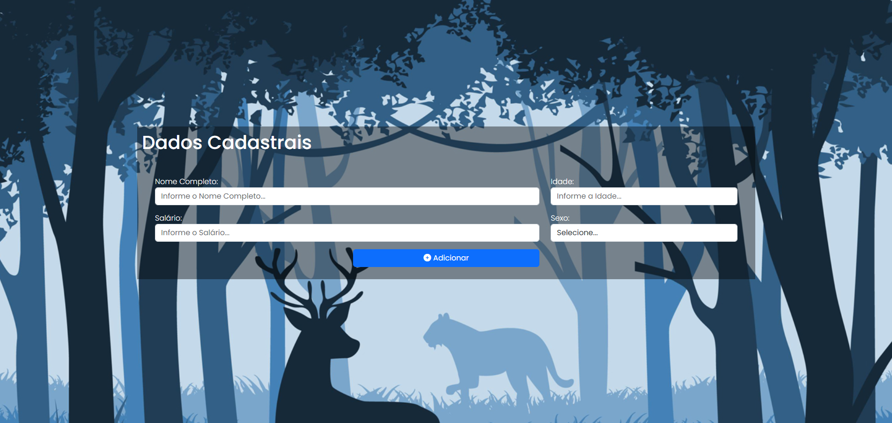

# AT2-JS
Atividade Avaliativa de Web JS com Vetores e Objetos (AT2).

### Estrutura do projeto:

A paz raiz é a AT2-JS, onde estão as duas avaliações, dentro de cada pasta de avaliação tem uma estrutura contendo: 

- CSS (para estilização).
- Images (para armazenar as imagens utilizadas em cada projeto).
- JS (com os scripts em JavaScript).
- index.html com a estrutura HTML do site.

### AT1: (PENDENTE - FALTA FINALIZAR)

Tela de cadastro (Com Bootstrap), solicitando Nome, Idade, Sexo e Salário, salvando tudo em session storage (50) e não deixando cadastrar Nome repetido.

### AT2: (CONCLUÍDO)

Tela de cadastro (HTML e CSS), solicitando UserName, Email, Password e ConfirmPassword, salvando tudo em session storage (50) e não deixando cadastrar UserName repetido.

